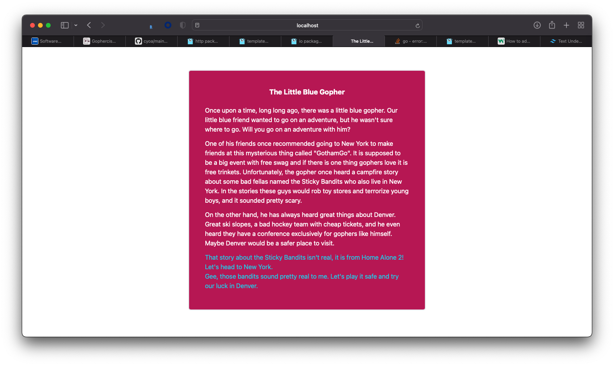

# Choose Your Own Adventure
Created an online Go application that takes the user through a story by making the user choose certain decision. The goal is to reach `Home`. 

## Usage
Simply type `go run main.go` to start the server on port 8080. You may optionally define your own story by passing in the flag:
```
--filename <The filename containing the CYOA story>
```
Note: The JSON should have the same structure as `gopher.json` and must include a key of value `intro`.

## Screenshots
